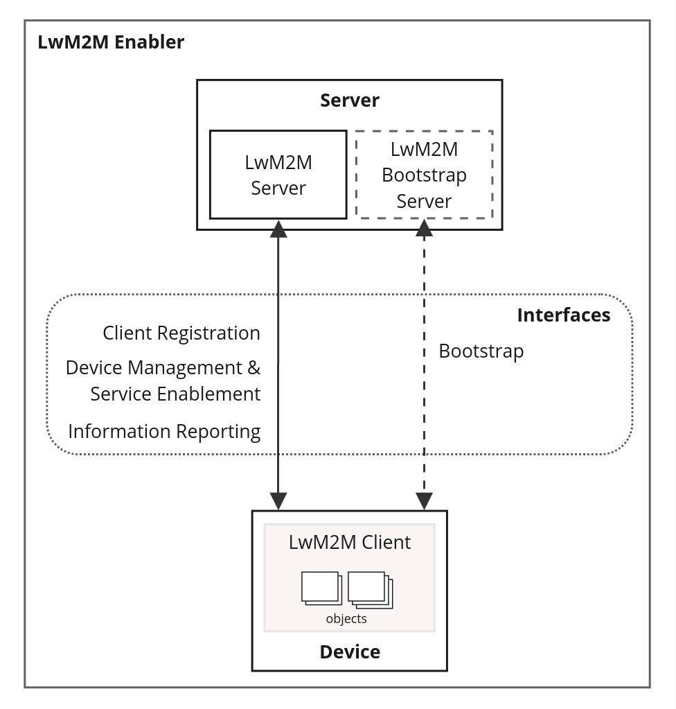

OMA Lightweight M2M (LwM2M) is a protocol for machine to machine (M2M) or Internet of things (IoT) device management and service enablement. It was designed for sensor networks and the demands of a machine-to-machine (M2M) environment and specified at the Open Mobile Alliance (OMA) SpecWorks Device Management Working Group.

**Protocol scope:**
- **Device management**, including remote provisioning of security credentials, firmware updates, remote device diagnostics and troubleshooting.
- **Service enablement**, including sensor and meter readings, remote actuation and configuration of host devices.

## Documents & Resources

:::tip[Did you know?]
The **specifications** are best source of informations! Don't let yourself be overwhelmed. Open the table of contents and jump directly to the sections you need. 

A good introduction is provided by the [LwM2M v1.1 slides][lwm2m_slides_intro],
:::

**Documents:**

- [Lightweight Machine to Machine Technical Specification: Core (1.2.1 / 2022-12-09)][lwm2m_spec_core]
- [Lightweight Machine to Machine Technical Specification: Transport Bindings (1.2.1 / 2022-12-09)][lwm2m_spec_transport]
- [Lightweight Machine to Machine Requirements (1.2 / 2020-11-10)][lwm2m_requirements]

**Useful links:**

- [OMA Technical Dashboard][lwm2m_oma_home]
  - [Object and Resource Registry][lwm2m_registry]
  - [Object schema v1.1 (LWM2M-v1_1.xsd)][lwmwm_object_schema_1_1]
- [Introduction slides (LwM2M v1.1)][lwm2m_slides_intro]

[lwm2m_spec_core]: https://www.openmobilealliance.org/release/LightweightM2M/V1_2_1-20221209-A/OMA-TS-LightweightM2M_Core-V1_2_1-20221209-A.pdf
[lwm2m_spec_transport]: https://www.openmobilealliance.org/release/LightweightM2M/V1_2_1-20221209-A/OMA-TS-LightweightM2M_Transport-V1_2_1-20221209-A.pdf
[lwm2m_requirements]: https://www.openmobilealliance.org/release/LightweightM2M/V1_2_1-20221209-A/OMA-RD-LightweightM2M-V1_2-20201110-A.pdf
[lwm2m_slides_intro]: https://www.openmobilealliance.org/release/LightweightM2M/Lightweight_Machine_to_Machine-v1_1-OMASpecworks.pdf
[lwm2m_oma_home]: https://technical.openmobilealliance.org/
[lwm2m_registry]: https://technical.openmobilealliance.org/OMNA/LwM2M/LwM2MRegistry.html
[lwmwm_object_schema_1_1]: http://www.openmobilealliance.org/tech/profiles/LWM2M-v1_1.xsd

## Architecture overview

The whole system is called **LwM2M Enabler** has two components. The **LwM2M Server** and the **LwM2M Client**. The **LwM2M Device** acts as a Client and the **M2M service, platform or application** acts as the Server.

Source: Technical Specification: Core v1.2.1

### Interfaces

Four **interfaces** are designed between these two components.

- Bootstrap
- Client Registration
- Device management and service enablement
- Information Reporting

:::note
The **Bootstrap** interface and server are not in the scope of this project!  
We are going to register Clients with a pre-defined Server.
:::

Each of these interfaces is related to a set of **operations**.

### Operations

The operations can be classified into **uplink** operations and **downlink** operations. The uplink operatations are initiated by the device and the downlink operations are initiated by the server. They are mapped to protocol mechanisms in the LwM2M Transport specification.

| Interface                                | Direction | Operation                                                                                         |
|------------------------------------------|-----------|---------------------------------------------------------------------------------------------------|
| Bootstrap                                | Uplink    | Bootstrap-Request, Bootstrap-Pack-Request                                                         |
| Bootstrap                                | Downlink  | Bootstrap-Write, Bootstrap-Read, Bootstrap-Discover, Bootstrap-Delete, Bootstrap-Finish           |
| Client Registration                      | Uplink    | Register, Update, De-register                                                                     |
| Device Management and Service Enablement | Downlink  | Create, Read, Read-Composite, Write, Delete, Execute, Write-Attributes, Write-Composite, Discover |
| Information Reporting                    | Downlink  | Observe, Observe-Composite, Cancel Observation, Cancel Observation-Composite                      |
| Information Reporting                    | Uplink    | Notify, Send                                                                                      |

## Resource Model

The LWM2M Enabler defines a simple **resource model**. Relationships between Resources, Objects, and the Client are illustrated in the following figure.

Source: Technical Specification: Core v1.2.1

- Each piece of information made available by the LWM2M Client is a **Resource**.
- Resources are logically organized into **Objects**.
- The **Client** may have any number of Resources, each of which belongs to an Object.
- Resources are defined per Object, and each Resource is given a unique identifier within that Object.
- Resources and Objects have the capability to have **multiple instances** of the Resource or Object, called **Object Instance** and **Resource Instance**.
- Each Object and Resource is defined to have one or more **operations** that it supports.

<!--
https://wiki.openmobilealliance.org/display/TOOL/What+is+LwM2M

https://github.com/eclipse-leshan/leshan/tree/master

SCHEMA?: Not that easy:
http://www.openmobilealliance.org/tech/profiles/LWM2M-v1_1.xsd
-->